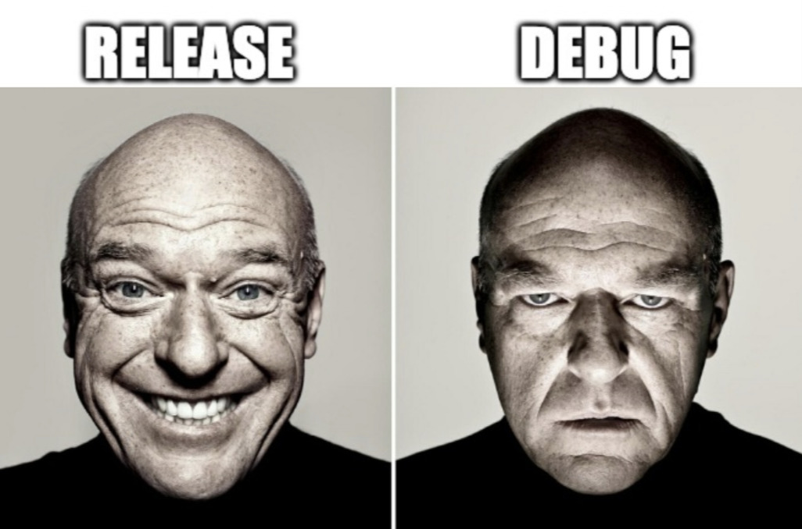

cargo-memex
=========================

Besides their size, rust binaries have a significant disadvantage: rust binaries are not memes yet.

`cargo-memex` is a `cargo` subcommand that makes it easy to ditch regular rust binaries in favor of memes, which is arguably the far superior container format for rust executables. Rather than to ordinary rust binaries, `cargo-memex` compiles rust code directly into a meme of your liking.

`cargo-memex` executeable rust memes thus provide a number of significant improvements over regular rust executables:

Standard rust executables always look the same, which means consistently boring, e.g.: .

With `cargo-memex` they can look like this:

Also, normal rust executables cannot be easily posted on imageboards like tumbler, or to show off your rust skills on [r/rustjerk](https://www.reddit.com/r/rustjerk/) or on slack or twitter. This also makes it possible to use imagehosting services to distribute your executables.

Another limitation of rust binaries is, that `debug` and `release` executables are visually indistinguishable.

`cargo-memex` fixes this problem by fetching a random meme from [r/rustjerk](https://www.reddit.com/r/rustjerk/) using [D3vd/Meme_Api](https://github.com/D3vd/Meme_Api) each time.

If no meme could be found it falls back to the corresponding segment of:

You can also request a random meme from any subreddit with the `--subreddit "<subreddit>"` option.

The same problem exists for different release versions which visually always look completely identical. With `cargo-memex` you can compile each new release into a different meme to highlight the differences. This makes support much easier since everyone can directly see which version is installed.

## Installation

##### `cargo install cargo-memex`

## Usage

Compile a new cargo project into the built in [rust borrow checker meme](./resources/borrow-checker.jpg):

Compile your current project into the meme above, for other built in memes see [resources](./resources)

##### `cargo memex build tradeoffer`

Compile your current project in release mode with a random meme from [r/rustjerk](https://www.reddit.com/r/rustjerk/)

##### `cargo memex build --release`

Compile with local meme

##### `cargo memex build ./meme.jpg`

Use a jpeg meme on the web

##### `cargo memex build "https://meme.jpg"`

Use a random jpeg meme from a subreddit

##### `cargo memex build --subreddit dankmemes`

To execute a memex executable meme

##### `cargo memex exec meme.jpg`

Build then execute in one step

##### `cargo memex run`

## Roadmap

Once memes are more widely adapted as rust executables, which is expected to happen soon, support for publishing memes will be required.

The recent NFT frenzy has shown that there is a high demand for NFT based solutions, and that especially memes can be very [lucrative](https://www.nytimes.com/2021/04/29/arts/disaster-girl-meme-nft.html).
Hence, solutions for cargo-memex are currently being investigated in order to tap this growing market.
Ideally, the `cargo publish` subcommand should be extended by an `--nft` option, so that developers can directly publish a new version of their rust project as a memex NFT.

## Known Limitations

* only works on unix
* only jpeg supported at this point

Licensed under either of these:

* Apache License, Version 2.0, ([LICENSE-APACHE](LICENSE-APACHE) or
  https://www.apache.org/licenses/LICENSE-2.0)
* MIT license ([LICENSE-MIT](LICENSE-MIT) or
  https://opensource.org/licenses/MIT)
* The Jpeg encoder/decoder adapter are slightly modified copies of [image-rs/image](https://github.com/image-rs/image) which are license under [MIT](https://github.com/image-rs/image/blob/master/LICENSE)
* The Jpeg decoder is a slightly modified copy of [image-rs/jpeg-decoder](https://github.com/image-rs/image) which are license under either of
    * [MIT](https://github.com/image-rs/jpeg-decoder/blob/master/LICENSE-MIT)
    * [Apache 2.0](https://github.com/image-rs/jpeg-decoder/blob/master/LICENSE-APACHE)
